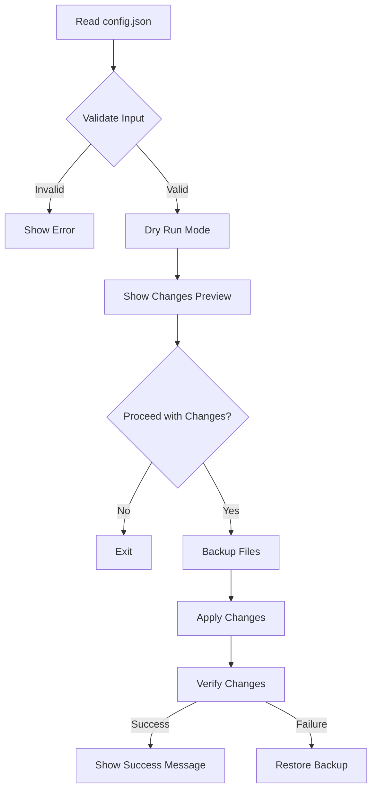

# Android App Rename CLI Tool Plan

## Overview
This document outlines the plan for implementing a CLI tool that will rename Android package name and app name based on configuration in `config.json`.

## Flow Diagram


## Implementation Details

### 1. Input Validation
- Validate package name follows Java package naming convention
  - Lowercase letters
  - Valid separators (dots)
  - Alphanumeric characters
- Verify app name contains valid characters
- Check if all required files exist

### 2. Files to Modify
```
- android/app/build.gradle.kts
  - namespace
  - applicationId
- android/app/src/main/AndroidManifest.xml
  - activity android:name
- android/app/src/main/res/values/strings.xml
  - app_name string
- android/settings.gradle.kts
  - rootProject.name
```

### 3. Directory Structure Changes
- Move files from old package path to new package path
- Update import statements in Kotlin files

### 4. CLI Implementation
```typescript
// Command structure
rename-android-app [options]

Options:
--config <path>     Path to config.json (default: ./config.json)
--dry-run          Show changes without applying them
--no-backup        Skip backup creation (not recommended)
```

### 5. Backup System
- Create timestamped backup of all files to be modified
- Store backups in .backup directory
- Implement restore functionality

### 6. Change Preview System
- Show diff of all files to be modified
- Display directory structure changes
- List all affected files

### 7. Safety Measures
- Verify all file operations before committing changes
- Implement rollback on failure
- Validate file contents after changes

## File Changes Example

### config.json
```json
{
  "appName": "NewAppName",
  "packageName": "com.example.newapp"
}
```

### Before/After Examples

#### build.gradle.kts
```diff
- namespace = "com.prasi.mobile"
- applicationId = "com.prasi.mobile"
+ namespace = "com.example.newapp"
+ applicationId = "com.example.newapp"
```

#### strings.xml
```diff
- <string name="app_name">PrasiMobile</string>
+ <string name="app_name">NewAppName</string>
```

#### settings.gradle.kts
```diff
- rootProject.name = "PrasiMobile"
+ rootProject.name = "NewAppName"
```

## Implementation Steps

1. Set up TypeScript project structure
2. Implement core functionality:
   - Config file reading
   - Validation functions
   - File system operations
3. Implement backup system
4. Create dry-run functionality
5. Add command-line interface
6. Implement change preview system
7. Add safety checks and rollback
8. Write tests
9. Add documentation